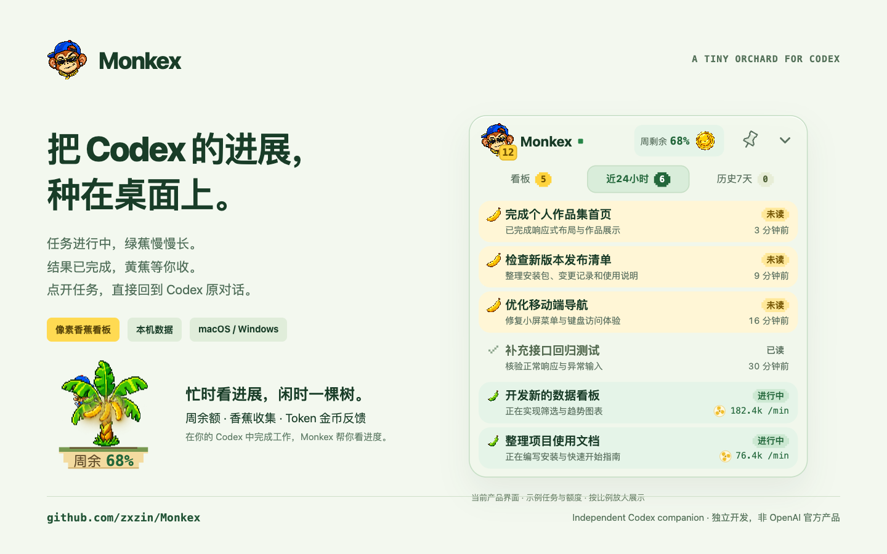

# Monkex · Codex 桌面任务看板

**把 Codex 的进展，种在桌面上。**

Monkex 面向 **OpenAI Codex 桌面用户**：用像素香蕉树展示运行任务和未读结果，点击看板任务即可回到 Codex 原对话。支持 macOS Apple Silicon 与 Windows x64。

A tiny, local-first desktop companion for Codex: live task status, unread results, weekly quota and playful banana collectibles. Independent software; not an OpenAI product.

[下载安装包](https://github.com/zxzin/Monkex/releases) · [交互使用手册](docs/guide.html) · [发给 Codex 的安装提示词](INSTALL_WITH_CODEX.md) · [安装与故障排查](docs/INSTALL.md) · [更新记录](CHANGELOG.md) · [反馈问题](https://github.com/zxzin/Monkex/issues)

> 展示图由当前产品界面渲染，使用公开示例任务与额度，未包含作者真实对话。看板直接显示 Codex 已有任务标题与进展文本。

## 可点击的使用手册

[下载单文件 HTML 手册](https://github.com/zxzin/Monkex/raw/refs/heads/main/docs/guide.html)，保存后用浏览器打开即可，支持离线浏览与手机排版。GitHub 文件页展示源码；可点击文件页的 **Download raw file** 下载后体验交互。

手册包含 11 个章节：产品概览、桌面树、三种状态、任务看板与跳转、收香蕉与本周收成、额度与 Token 活跃度、固定与退出、设计语言、安装、数据边界及常见问题。可亲自尝试拖动树、切换状态、收香蕉、额度变色与图钉效果。

全部使用独立示例数据，素材已内嵌；无需登录或连接 Codex，不读取或修改真实任务。这里提供 HTML 文件，尚未启用 GitHub Pages 在线托管。

## 能做什么？

- **桌面香蕉树**：绿香蕉代表进行中，黄香蕉代表完成未读，香蕉皮代表已读。整棵树按住拖动、轻点展开，收起时花盆显示周剩余额度。
- **本周收成**：头像角标记录本机自然周收蕉次数（周一至周日），重启保留；系统减少动态模式仍累计，同一结果仅计一次。
- **快速找回任务**：看板、近24小时、历史7天；近期未读优先，点击直达 Codex 原任务。
- **收香蕉反馈**：查看未读结果时收集香蕉，提供轻量弹跳与收获反馈。
- **Token 活跃度**：额度旁的圆形香蕉币在观测到消耗时缓慢旋转，点击刷新任务与额度；余额从绿到黄到红。
- **接入自己的 Codex**：读取当前系统用户的本机任务，无需作者账号或额外绑定表单。

金币是活跃度提示，一枚金币不代表固定 Token 数或费用。周额度保持 Codex 返回的真实百分比，Monkex 不估算剩余 Token 总数。在 Codex 内打开任务后的已读同步依赖当前本地记录格式，不兼容时保留原状态。

## 下载与安装

当前公开版为 **0.1.1 Preview**。以 [Releases 页面](https://github.com/zxzin/Monkex/releases)实际可见的公开附件为准；草稿不是公开下载。

| 电脑 | 对应附件 | 安装 |
| --- | --- | --- |
| Mac · Apple Silicon（M系列） | Monkex-macOS-arm64.zip | 解压，将 Monkex.app 放到用户或系统“应用程序”目录 |
| Windows 10/11 · x64 | Monkex-Windows-x64-setup.exe | 双击安装到当前用户，按提示补齐 WebView2 |
| Intel Mac / Windows ARM64 / Linux | 暂无对应包 | 暂停安装，关注后续版本 |

**先安装并登录 Codex，再启动 Monkex。** 安装包内置后端，普通用户无需 Python、Node.js 或 Rust。

把下面这段话发给拥有本机操作权限的 Codex，即可让它选择版本并协助安装：

~~~text
请帮我安装 Monkex：https://github.com/zxzin/Monkex 。
先读取仓库 README、INSTALL_WITH_CODEX.md 和公开 Releases，识别本机系统及 CPU 架构，下载对应的最新公开安装包（可选 Preview），核验 SHA256，保留已有用户数据并安装。
检查并连接我自己的本机 Codex。没有匹配包时暂停说明，不默认源码编译。不读取或上传凭据，不修改 Codex 配置。遇到未签名/未公证警告、登录或管理员授权时先解释并让我确认，不关闭系统安全保护。
最后报告安装版本、路径、启动方式和实际验证结果。
~~~

[完整中英文提示词](INSTALL_WITH_CODEX.md)。系统安全确认、Codex 登录等步骤仍由用户完成。

### 预览版限制

- macOS 采用本地 ad-hoc 签名，**未经过 Apple 公证**；Windows **没有发行者签名**，可能出现系统安全提示。核验来源和哈希后由用户决定是否继续，保留系统安全保护。
- 平台测试范围和 SHA256 以对应 Release 为准。Windows CI 安装/窗口/离线启动通过，不等于真实已登录 Codex 的完整集成验收。
- Codex 需要支持本机 app-server 和 codex://threads/… URL 协议。非标准路径可设置 MONKEX_CODEX_PATH，详见安装文档。
- 当前无自动更新、开机自启或云同步。

## 使用

启动 Codex → 启动 Monkex → 点击香蕉树展开 → 点击任务回到原对话。图钉按下时切换窗口保持展开，拔起时点击其他应用窗口自动收成香蕉树；看板内部按钮正常使用。任务跳转成功并完成查看反馈后自动收起，失败保持可见。右键树可以退出，猴子头像展示本周收蕉计数，收香蕉动效默认开启，遵循系统减少动态偏好。

每次启动默认出现在主屏工作区右下角，避开 Dock／任务栏。按住树或花盆拖动，松手保持收起；轻点展开。macOS 运行时不占 Dock，Windows 窗口不占任务栏，桌面／开始菜单启动入口仍可使用；退出请右键桌面香蕉树选择“退出 Monkex”。用户手动固定的系统快捷方式保持原样。

Monkex 只观察、记录已读并导航。新建任务、回复、审批和执行始终在 Codex 内完成。

## 隐私与额度

后端仅监听 127.0.0.1:8766，读取当前用户 Codex 的任务元数据、近期上下文与运行记录。Monkex 已读记录保存在系统应用数据目录。安装包不包含作者任务、训练数据、凭据或开发原型。

它遵循现有 CODEX_HOME。若多个 Codex 账号共享同一系统用户或历史目录，Monkex 不按云账号二次拆分；它是本机目录级接入，不是跨账号云同步。

看板直接读取并展示 Codex 已有任务信息，不额外发起模型生成请求。Monkex 自身无分析埋点或远程上传服务，登录由 Codex 管理。

## 开发者构建

普通用户下载发行附件即可。开发者需 Python 3.11+、Node.js 22、Rust stable 和 [Tauri 平台依赖](https://v2.tauri.app/start/prerequisites/)。

~~~sh
python -m venv .venv
# 激活虚拟环境后：
python -m pip install pyinstaller==6.19.0
npm ci --prefix desktop_shell
python scripts/build_monkex_release.py
cd desktop_shell
npx tauri build --config src-tauri/tauri.release.conf.json --bundles nsis
# macOS 将 nsis 改为 app，回到仓库根目录后运行：
# python scripts/finalize_monkex_macos.py
~~~

macOS 流程包含嵌套代码签名与隔离后端测试。Python sidecar 当前需要有范围的 library-validation 例外，主 UI 保留校验；统一发行者签名完成后再移除此兼容层。

## Rights

Copyright © 2026 Monkex contributors. Source-available; no general open-source license is granted. You may download and run released applications for personal use. Codex and OpenAI names belong to their respective owners. Character and coin artwork was generated with ImageGen.
